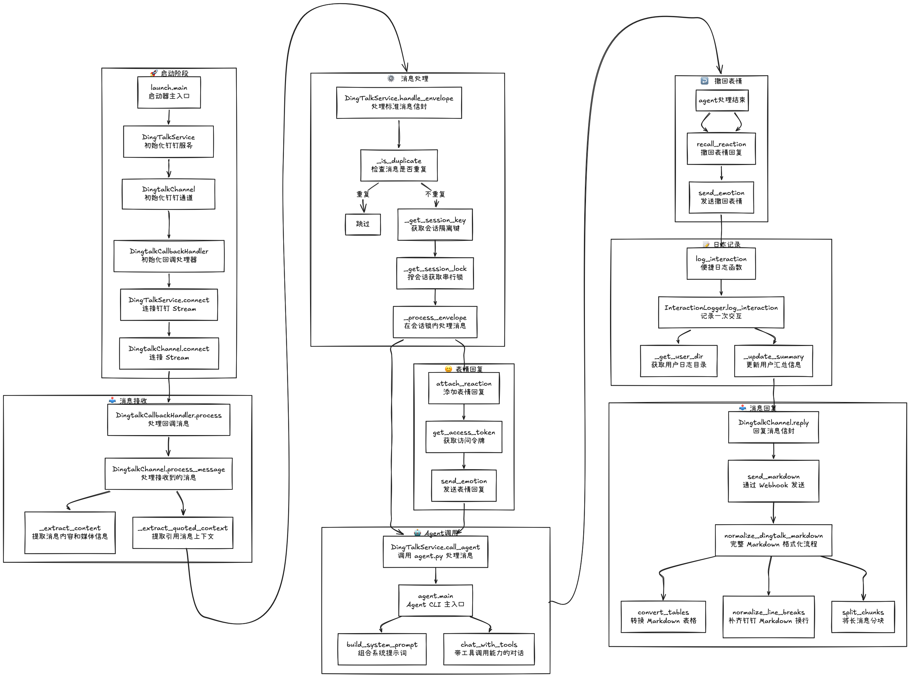

# dingtalk_agent_robot

钉钉机器人 Agent 服务，支持消息接收、处理和回复。

## 目录结构

```
dingtalk_agent_robot/
├── channels/
│   └── dingtalk/
│       ├── channel.py      # 钉钉 Channel - Stream 连接、消息解析
│       └── utils.py        # 钉钉 API - 表情回复、消息发送
├── core/
│   ├── service.py          # 服务编排 - 去重、会话隔离、调用 Agent
│   ├── logger.py           # 交互日志 - 用户对话记录
│   └── markdown.py         # Markdown 格式化 - 表格转换、分块
├── tools/
│   └── launch_test.py      # 测试工具 - 验证 Stream 连接
├── .env                    # 环境配置
├── agent.py                # Agent CLI - 命令执行、LLM 调用
└── launch.py               # 启动器
```

## 依赖安装

```bash
pip install dotenv requests dingtalk_stream certifi anthropic
```
## 证书安装

```bash
/Applications/Python 3.x/Install Certificates.command || pip install certifi
```
## 配置

创建 `.env` 文件：

```env
DINGTALK_CLIENT_ID=your_app_id
DINGTALK_CLIENT_SECRET=your_app_secret
```

## 运行

```bash
# 启动服务
python launch.py

# 测试模式（无 Agent）
python tools/launch_test.py

# 单独调用 Agent
python agent.py -i "你的消息"
```

## 日志

交互日志存储在 `logs/` 目录：

```
logs/
└── {user_id}/
    ├── 2026-04-18.log    # 每日对话记录
    └── summary.json      # 用户统计汇总
```

查看日志：
```
open tools/log-viewer.html
```
或者
```bash
python core/logger.py --dump LOG_DIR
```


## 流程


## 开源协议

[Apache License 2.0](LICENSE)

## 致谢

`dingtalk stream` 实现思路借鉴于 [qwen-code](https://github.com/QwenLM/qwen-code)
